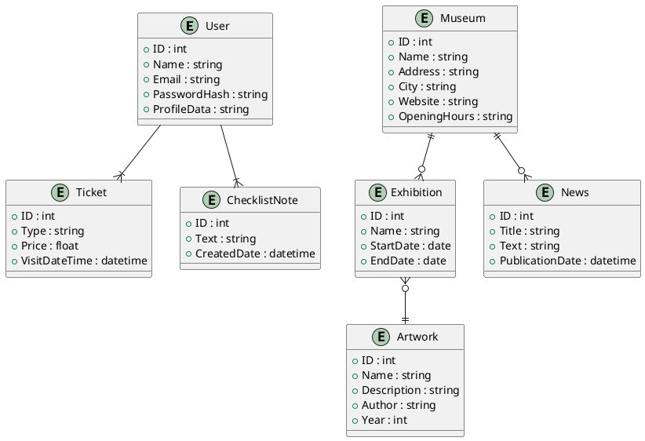
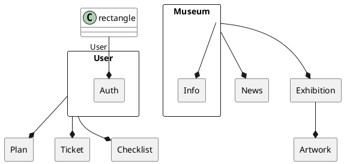

# Диаграмма ER

## Концептуальная модель данных

### В данной ER-диаграмме:

* User представляет пользователей приложения.
* SocialAccount содержит информацию о социальных аккаунтах пользователей.
* MuseumVisit отображает посещения музея пользователями.
* Museum представляет музеи.
* Ticket содержит информацию о билетах на посещение музея.
* Checklist позволяет пользователям создавать заметки и чек-листы о посещении музея.
* ExhibitionNews содержит информацию о новостях выставок в музеях.
