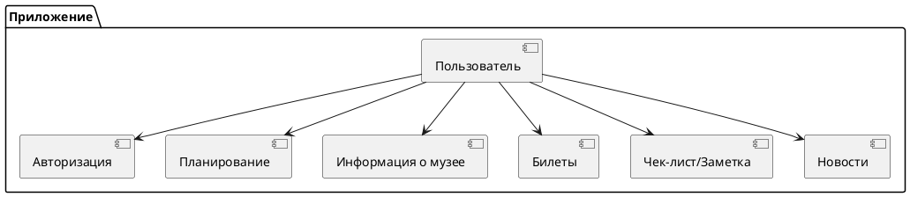
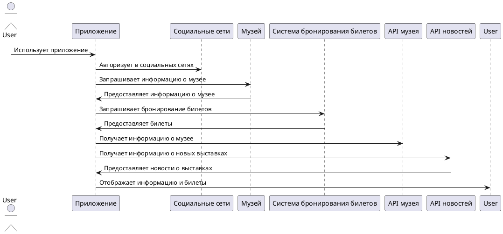

# Общее описание

## Видение продукта

Приложение представляет собой удобный инструмент для планирования и организации посещений музеев, позволяя пользователям составить список произведений искусства, которые они хотят посмотреть, и выстроить оптимальный маршрут по музейным залам.

### Общее архитектурное видение системы

### Схема MSA для приложения

В схеме MSA (Microservices Architecture) для данного приложения представлены следующие компоненты:

1. **Пользователь**: Этот компонент представляет собой конечного пользователя приложения.

2. **Авторизация**: Отвечает за процесс аутентификации пользователя через аккаунты в социальных сетях.

3. **Планирование**: Обеспечивает функциональность для планирования похода в музей, включая выбор города, музея, даты и времени.

4. **Информация о музее**: Предоставляет пользователю информацию о музее, включая режим работы, сайт и адрес.

5. **Билеты**: Позволяет пользователю прикреплять билеты к посещению музея.

6. **Чек-лист/Заметка**: Предоставляет возможность создавать чек-лист или заметки о посещении музея, включая список залов для посещения и интересующих экспонатов.

7. **Новости**: Отвечает за предоставление пользователю информации о новых выставках и других новостях в музее.

Каждый из этих компонентов представляет собой отдельный сервис, который может быть развернут и масштабирован независимо от остальных. Такой подход позволяет улучшить масштабируемость, гибкость и надежность приложения.



### Основная функциональность:

1. **Авторизация через социальные сети:**
    - Пользователи могут войти в приложение, используя свои учетные данные из популярных социальных сетей, таких как Facebook, Twitter или Google.

2. **Планирование посещения музея:**
    - Пользователи могут выбрать город, музей, дату и время своего посещения, чтобы получить персонализированный маршрут.

3. **Получение информации о музее:**
    - Приложение предоставляет полезную информацию о выбранном музее, включая режим работы, веб-сайт и адрес.

4. **Прикрепление билетов к посещению:**
    - Пользователи могут прикрепить к своему посещению электронные или физические билеты, чтобы обеспечить удобство и быстрый доступ в музей.

5. **Создание чек-листа посещения:**
    - Пользователи могут создать чек-лист или заметку о посещении, указав, какие залы и экспонаты они хотели бы увидеть в музее.

6. **Лента новостей о выставках:**
    - Приложение предоставляет пользователю доступ к ленте новостей о текущих и предстоящих выставках в музее, чтобы оставаться в курсе последних событий.

Это приложение обеспечивает удобный и интуитивно понятный способ планирования и организации посещений музеев, что делает музейные походы более интересными и продуктивными для пользователей.

## Перспективы продукта

Планы по развитию продукта после его выпуска зависят от множества факторов, таких как обратная связь пользователей, изменения на рынке, технологические инновации и стратегические цели компании. Однако, рассмотрим несколько общих направлений развития:

1. **Обновление и улучшение функциональности**: На основе отзывов пользователей и анализа использования приложения, команда разработки может работать над улучшением существующей функциональности, добавлением новых возможностей и оптимизацией интерфейса.

2. **Расширение платформы и доступности**: Можно рассмотреть возможность расширения приложения на другие платформы (например, Android, веб-версия), а также увеличение его доступности для широкого круга пользователей, в том числе за счет локализации на разные языки.

3. **Интеграция с дополнительными сервисами и партнерами**: Разработчики могут рассматривать возможность интеграции с другими сервисами, такими как сервисы бронирования билетов, туристические агентства, культурные мероприятия и т. д.

4. **Улучшение аналитики и отчетности**: Для более глубокого понимания потребностей пользователей и эффективности приложения можно улучшить систему аналитики, собирать больше данных о поведении пользователей и предоставлять более детальные отчеты.

5. **Безопасность и защита данных**: После выпуска продукта важно обеспечить его безопасность и защиту данных пользователей. Команда разработки должна продолжать обновлять и улучшать меры безопасности в соответствии с последними стандартами и требованиями.

Эти планы могут быть дополнены или изменены в зависимости от ряда факторов, но они представляют общий каркас для дальнейшего развития продукта после его выпуска.

```plantuml
@startgantt

Project starts the 2024/04/01
[Обновление функциональности] as [EXT] lasts 30 days
[Расширение платформы и доступности] starts at [EXT]'s end and lasts 20 days
[Интеграция с дополнительными сервисами] starts at [Обновление функциональности]'s end and lasts 25 days
[Улучшение аналитики и отчетности] starts at [Расширение платформы и доступности]'s end and lasts 15 days
[Безопасность и защита данных] starts at [Интеграция с дополнительными сервисами]'s end and lasts 15 days
[Завершение проекта] starts at [Улучшение аналитики и отчетности]'s end and lasts 5 days

@endgantt
```

## Взаимодействие продукта с другими продуктами и компонентами

1. **Социальные сети**:
    - Приложение использует API социальных сетей для авторизации пользователей через их аккаунты в социальных сетях.
    - Это упрощает процесс входа в систему для пользователей и позволяет использовать существующие учетные записи.

2. **API музеев и информационных источников**:
    - Для получения информации о музеях, их расписании работы, текущих выставках и коллекциях, приложение использует API музеев и информационных источников.
    - Это обеспечивает актуальность данных и обогащает пользовательский опыт.

3. **Сервисы бронирования билетов**:
    - Приложение интегрируется с сервисами бронирования билетов для получения доступа к билетам и их прикреплению к планируемому походу в музей.

4. **Сервисы карт и навигации**:
    - Для оптимального планирования маршрута в музее приложение использует сервисы карт и навигации.
    - Эти сервисы помогают построить оптимальный маршрут по залам и экспонатам музея.

5. **Пользователи**:
    - Пользователи могут делиться своими списками произведений искусства, заметками о посещении и рекомендациями друг с другом.
    - Они также могут оценивать и комментировать произведения искусства, обмениваться впечатлениями и опытом.

Эти взаимодействия способствуют улучшению пользовательского опыта, делают приложение более полезным и интересным для пользователей, а также расширяют его функциональность и возможности.




## Классы и характеристики пользователей

| Класс пользователей         | Авторизованный пользователь                                                                          | Неавторизованный пользователь                                                    |
|-----------------------------|------------------------------------------------------------------------------------------------------|----------------------------------------------------------------------------------|
| Обычные пользователи        | - Могут создавать списки произведений искусства для посещения.                                       | - Могут просматривать информацию о музеях и их экспонатах.                       |
|                             | - Могут планировать походы в музеи, указывая город, музей, дату и время.                             | - Могут просматривать информацию о текущих выставках и музеях.                   |
|                             | - Могут прикреплять билеты к походам и создавать чек-листы или заметки о посещении.                  | - Могут искать музеи и выставки по городу, но без возможности сохранения планов. |
| Авторизованные пользователи | Все вышеописанные функции доступны авторизованным пользователям.                                     | Недоступны                                                                       |
| Администраторы              | - Обладают правами администрирования приложением.                                                    | - Недоступно.                                                                    |
|                             | - Могут управлять контентом приложения, добавляя новые музеи, выставки и экспонаты.                  |                                                                                  |
|                             | - Отвечают за обновление информации о музеях и их расписании работы.                                 |                                                                                  |
| Разработчики                | - Работают над разработкой и обновлением функциональности приложения.                                | - Недоступно.                                                                    |
|                             | - Могут вносить изменения в функциональность, улучшать производительность и безопасность приложения. |                                                                                  |
|                             | - Работают над интеграцией с внешними сервисами и системами.                                         |                                                                                  |
| Модераторы                  | - Отвечают за контроль за содержанием и поведением пользователей.                                    | - Недоступно.                                                                    |
|                             | - Могут удалять неподходящий или негативный контент, модерировать комментарии и отзывы.              |                                                                                  |
|                             | - Обеспечивают соблюдение правил и политики приложения.                                              |                                                                                  |
| Партнеры музеев             | - Представители музеев или туроператоров, сотрудничающих с приложением.                              | - Недоступно.                                                                    |
|                             | - Могут предоставлять информацию о музеях, выставках и билетах.                                      |                                                                                  |
|                             | - Возможно обмен данными о посещаемости и интересах пользователей.                                   |                                                                                  |


## Ограничения разработки и реализации

1. **Интеграция с музеями**: Для получения актуальной информации о музеях, выставках и расписаниях работы требуется активная интеграция с базами данных музеев. Ограничения могут возникнуть из-за различий в API разных музеев, что потребует разработки гибкого и адаптивного механизма интеграции.

2. **Безопасность данных**: С учетом того, что пользователи могут предоставлять личные данные при авторизации и прикреплении билетов, необходимо обеспечить высокий уровень защиты данных. Это включает в себя шифрование данных, обеспечение конфиденциальности и защиту от несанкционированного доступа.

3. **Масштабируемость**: Приложение должно быть способно обрабатывать большое количество запросов от пользователей, особенно в периоды повышенного спроса, например, во время праздников или акций. Это требует эффективного масштабирования и оптимизации ресурсов серверов.

4. **Удобство использования**: Важно, чтобы приложение было интуитивно понятным и легким в использовании для широкого круга пользователей, включая тех, кто не имеет технического образования или опыта. Это может потребовать тщательного тестирования пользовательского интерфейса и обратной связи от пользователей.

5. **Кросс-платформенность**: Приложение должно быть доступно на различных платформах, таких как веб, мобильные устройства (iOS и Android) и, возможно, десктопные операционные системы. Это потребует разработки и поддержки различных версий приложения с соблюдением единых стандартов и функциональности.

6. **Соблюдение законодательства**: При разработке и внедрении приложения необходимо соблюдать все применимые законы и нормативные требования в области защиты данных, конфиденциальности и безопасности пользователей.

7. **Интеграция с социальными сетями**: Для реализации функциональности авторизации через аккаунты в социальных сетях требуется интеграция с соответствующими API платформ. Это может подвергнуться ограничениям и требовать соблюдения политики и правил социальных сетей.

Эти ограничения и требования являются важными при разработке приложения для планирования походов в музеи и должны учитываться на всех этапах процесса разработки.


## Допущения и зависимости

### Допущения

1. **Доступ к данным музеев**: Предполагается, что будет доступ к актуальным данным о музеях, выставках и произведениях искусства через API музейных организаций или сторонних сервисов.
2. **Стабильность API социальных сетей**: Для функциональности авторизации через аккаунты в социальных сетях требуется стабильное функционирование API платформ, таких как Facebook, Twitter, Google и других.
3. **Надежность интернет-соединения**: Для использования приложения требуется стабильное интернет-соединение для доступа к данным музеев, социальным сетям и другим сервисам.
4. **Безопасность данных**: Предполагается, что данные пользователей будут надежно защищены и обработаны в соответствии с применимыми нормативными требованиями.
5. **Совместимость с различными устройствами и платформами**: Предполагается, что приложение будет совместимо с различными операционными системами (iOS, Android, веб) и устройствами (мобильные телефоны, планшеты, десктопы).

### Зависимости

1. **API музеев**: Разработка и функционирование приложения зависит от доступа к актуальным данным музеев, таким как расписание работы, выставки и описание произведений искусства.
2. **API социальных сетей**: Функциональность авторизации через аккаунты в социальных сетях зависит от стабильной работы API платформ, таких как Facebook, Twitter, Google и других.
3. **Интернет-соединение**: Приложение требует доступа к сети Интернет для обмена данными с сервером, получения актуальной информации о музеях и выставках, а также для авторизации через социальные сети.
4. **Безопасность данных**: Реализация безопасности данных зависит от соблюдения правил шифрования, защиты от несанкционированного доступа и других мер безопасности, которые могут быть реализованы с помощью сторонних сервисов или инструментов.
5. **Требования к платформам и устройствам**: Разработка и тестирование приложения должны учитывать требования различных платформ (iOS, Android, веб) и устройств (мобильные телефоны, планшеты, десктопы), чтобы обеспечить оптимальную работу на различных устройствах.
