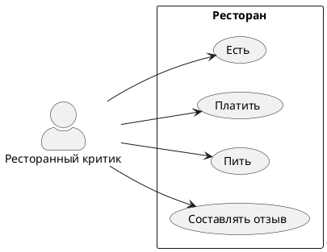
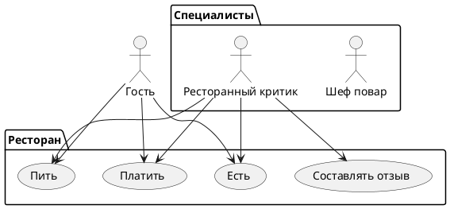

# Диаграмма вариантов использования

Составьте диаграмму вариантов использования. Выделите действующие лица, расставьте связи, не забудьте внешние системы, которые требуется учесть.

<code-block lang="plantuml" collapsible="true" src="RegistryNotificationService.puml">

</code-block>