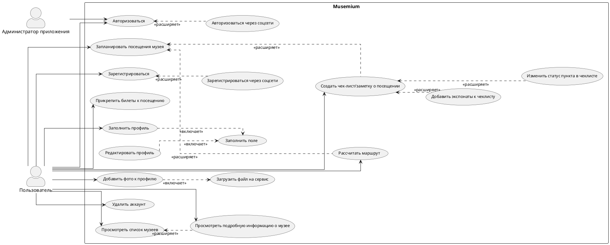

# Диаграмма вариантов использования

Диаграмма вариантов использования представляет собой графическое описание основных функций мобильного приложения для планирования и организации посещения музеев и выставок.

[//]: # ()
[//]: # (<code-block lang="plantuml" collapsible="true" src="RegistryNotificationService.puml">)

[//]: # ()
[//]: # (</code-block>)
